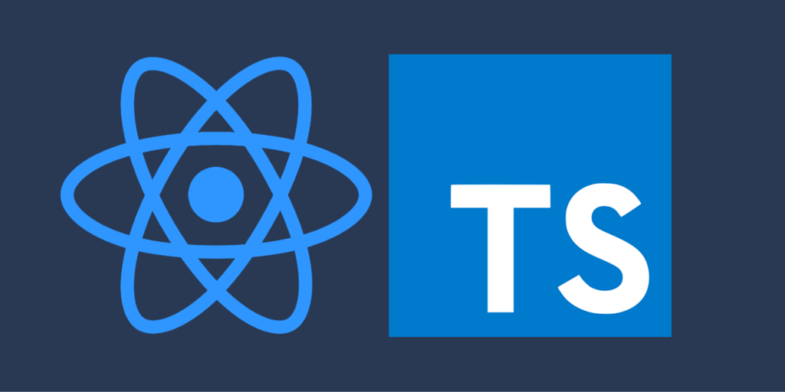
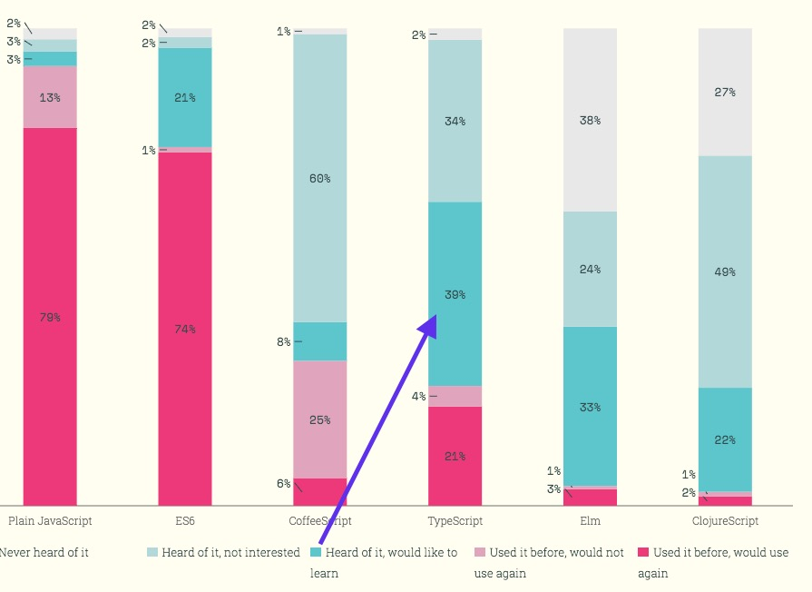
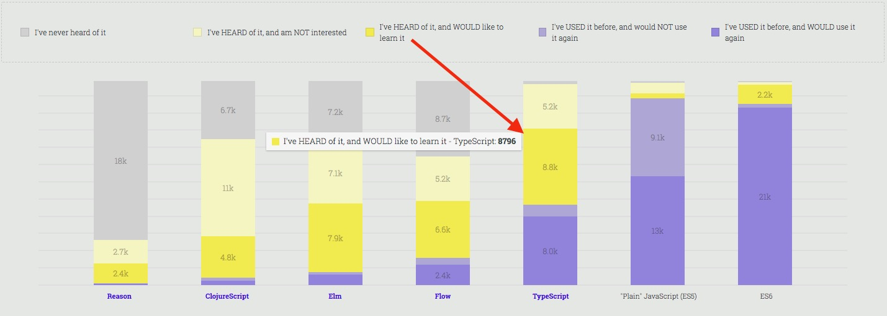

import { Head, Image, Appear } from 'mdx-deck'
import {css} from 'emotion'
import {Logo} from './components/logo.component'

export { default as theme } from './theme'

<Head>
  <title>Stop Wondering and Just TypeScript!</title>
</Head>

<Logo fixed size="50px"/>

# Stop Wondering and Just TypeScript!



---

### About me...
Doug Mason

<Logo size="80px" textSize="60px"/>
We create React Native apps <span className={css({fontSize: "80px"})}>📱</span>

Twitter: @douglas_mason

```notes
I'm Doug Mason and I work at Parsed.  We create React Native apps.
We're always looking to meet new people so check us out at parsed.io.
```

---

## About my relationship with TypeScript...

<Appear>
<ul>
  <li>Publicly released in 2012 &lt;👶🏽/&gt;</li>
</ul>
</Appear>

```notes
* Today I'm not going to teach typescript, but talk about my experience
  and how I think I can help others get into it as well.
* TypeScript, not me.  I'm an 80s baby

```
---

<ul>
  <li>I became a fan in 2014 ❤️</li>
  <Appear>
  
  </Appear>
</ul>

```notes
* I started looking at TypeScript around 2014.
* Being a C# developer at the time, it just felt like home.
* Something about compiler errors really spoke to me.
```
---

<ul>
  <li>I actually started using it in 2016 🖥</li>
</ul>
<iframe src="https://giphy.com/embed/H3CViADSOAHdK" width="480" height="269" frameBorder="0" class="giphy-embed" allowFullScreen></iframe>

```notes
* Took time to learn how to make the case for TS
* Decided to joined a team that already made this decision
```
---

# Word on the street...
I've been wanting to get into TypeScript, but...
<ul>
  <Appear>
    <li>my company doesn't like big change.</li>
    <li>my project is too big to add something like that.</li>
    <li>I'm scared</li>
  </Appear>
</ul>

```notes
At meetups and other gatherings I usual overhear people
talking about wanting to use TypeScript, but there are always excuses.
Some good, most not.
```

---
#### A lot of people "want to learn/use" TypeScript





```notes
* By the looks of the State Of JavaScript survey, a lot of people want to get into TypeScript.
* I bet a lot of them have the same excuses.
* Some good, most not
```

---

### So how do I get started with TypeScript?
1) [Create React App with TypeScript](https://github.com/wmonk/create-react-app-typescript)
```sh
npx create-react-app my-app --scripts-version=react-scripts-ts
cd my-app
npm start

# or with yarn
yarn create react-app my-app --scripts-version=react-scripts-ts
cd my-app
yarn start
```
```notes
* So how do I get into TypeScript
* Well you could use the no config CRA with TS
```

---

2) Create React App converted to TypeScript

... [Click Here](http://lmgtfy.com/?s=d&q=Migrating+create-react-app+from+javascript+to+typescript)

```notes
What if you have an existing app made from Create React App?
I made a video for you on how to convert your app.
```

---

Let's try this on an existing project!


[Project Estimator](https://hungry-babbage-0adb47.netlify.com/)


[Github repo](https://github.com/douglas-mason/estimator)

---

Thanks `galvan` of [Stack Overflow](https://stackoverflow.com/questions/47508564/migrating-create-react-app-from-javascript-to-typescript)

👏👏🏻👏🏼👏🏽👏🏾👏🏿

---

<Logo size="80px" textSize="60px"/>

### Q & A: Please Speak Up!

#### Resources:

* [TypeScript Deep Dive](https://basarat.gitbooks.io/typescript/) free ebook
* [Design Patterns in TypeScript](https://www.youtube.com/watch?v=I1Z8XzHEEzk) on youtube (5 hour video!)
* [egghead.io](https://egghead.io/browse/languages/typescript) free and pro videos
* [Read the docs!](https://www.typescriptlang.org/docs/home.html) typescriptlang.org

#### Contact:

<ul>
  <li>twitter: @douglas_mason</li>
  <li>github: douglas-mason</li>
  <li>email: doug@parsed.io</li>
</ul>
